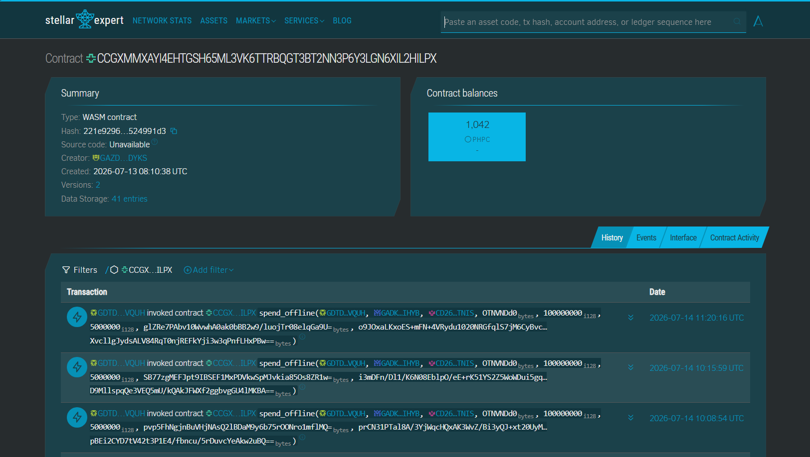

<br />
<div align="left">
  

  <br />
  <h3>&nbsp;&nbsp;Pijin Treasury Portal</h3>
  <p>&nbsp;&nbsp;<b><i>The back-office command center for the Pijin zero-data payment network.</i></b></p>
</div>
<br clear="left"/>

<p align="center">
  
  
  
  <a href="https://github.com/Kaido147/Pijin_Treasury_Portal/actions/workflows/ci.yml"></a>
</p>

---

## 📌 Project Overview

**Pijin** is a zero-data cellular transport layer for decentralized finance (DeFi). It empowers unbanked and offline communities in infrastructure-limited regions — such as remote municipalities and island provinces in the Philippines — to send secure, peer-to-peer (P2P) payments over standard GSM cellular networks (SMS), completely bypassing the need for expensive mobile data (4G/5G/WiFi).

The **Pijin Treasury Portal** is the dedicated back-office command center built parallel to the offline mobile app and Vercel relay infrastructure. It is a secure web dashboard accessible only to authorized network administrators. Unlike the mobile app — which handles end-user payments — this portal is responsible for the **operational health, financial integrity, and security of the entire Pijin protocol**.

<div align="center">
<table>
  <thead>
    <tr>
      <th align="left">Responsibility</th>
      <th align="left">Description</th>
    </tr>
  </thead>
  <tbody>
    <tr>
      <td><strong>Treasury Monitoring</strong></td>
      <td>Tracks the treasury wallet balance in real time. Every offline transaction programmatically routes a flat <strong>₱0.50 infrastructure toll</strong> to the treasury wallet on-chain. Admins monitor incoming tolls, verify correct distribution, and ensure the XLM gas pool is adequately funded to sponsor future user transactions.</td>
    </tr>
    <tr>
      <td><strong>Gateway Management</strong></td>
      <td>Registers and revokes authorized Android SMS gateway devices directly on the Soroban smart contract whitelist. Only whitelisted gateways can relay offline transactions to the blockchain. Admins monitor each node's live status (<code>active</code>, <code>offline</code>), uptime, and on-chain balance.</td>
    </tr>
    <tr>
      <td><strong>Node / Gateway Funding</strong></td>
      <td>Distributes native XLM reserves to authorized gateways and nodes. This ensures these routing devices have enough XLM to cover transaction/gas fees when sponsoring and submitting offline transactions to the Stellar blockchain.</td>
    </tr>
    <tr>
      <td><strong>Live Transaction Ledger</strong></td>
      <td>Streams all Soroban contract events (<code>spend_offline</code>, <code>deposit</code>, <code>withdraw</code>) in real time with a 10-second polling interval. Provides a full audit trail of every offline payment settled on-chain, filterable by event type, with live KPI summaries for total volume, tolls collected, and active gateway count.</td>
    </tr>
  </tbody>
</table>
</div>

---

## 🔁 Transaction Overview

Offline payments flow from the **mobile app → SMS gateway → Vercel relayer → Soroban contract → Stellar blockchain**. The Treasury Portal sits outside this flow as a **read-only observer and admin interface**, querying on-chain state and managing gateway registrations.

---

## ✨ Key Dashboard Features

<div align="center">
<table>
  <thead>
    <tr>
      <th align="left">Route</th>
      <th align="left">Name</th>
      <th align="left">Description</th>
    </tr>
  </thead>
  <tbody>
    <tr>
      <td><code>/command-center</code></td>
      <td><strong>Command Center</strong></td>
      <td>Core operations hub. Integrates with Freighter Wallet to display XLM &amp; PHPC balances (converted to PHP), KPI metrics, active gateway count, and Soroban RPC response latency.</td>
    </tr>
    <tr>
      <td><code>/gateway-ops</code></td>
      <td><strong>Gateway Operations</strong></td>
<<<<<<< HEAD
      <td>Register and revoke whitelisted Android SMS gateway nodes directly on the Soroban contract. Monitor live node telemetry (<code>active</code>, <code>offline</code>), uptime, and XLM balances. Fund nodes/gateways with native XLM.</td>
=======
      <td>Register and revoke whitelisted Android SMS gateway nodes directly on the Soroban contract. Monitor live node telemetry (<code>active</code>, <code>syncing</code>, <code>offline</code>), uptime, and XLM balances. Fund agent wallets with native XLM.</td>
>>>>>>> ade46416b414429616a25e3cfca1612e4d79a63c
    </tr>
    <tr>
      <td><code>/ledger</code></td>
      <td><strong>Transaction Ledger</strong></td>
      <td>Live-streaming audit ledger of all Soroban contract events (<code>spend_offline</code>, <code>deposit</code>, <code>withdraw</code>). Filterable by event type. Toggleable 10-second polling with KPI summaries for volume, tolls, and gateway activity.</td>
    </tr>
    <tr>
      <td><code>/fund-node</code></td>
<<<<<<< HEAD
      <td><strong>Node Funding</strong></td>
      <td>Distribute native XLM reserves to gateways and nodes to ensure they have enough XLM to pay for gas fees using the connected wallet via Freighter.</td>
=======
      <td><strong>Agent Liquidity</strong></td>
      <td>Distribute native XLM reserves to authorized local cash-in agent nodes using the connected administrator wallet via Freighter.</td>
>>>>>>> ade46416b414429616a25e3cfca1612e4d79a63c
    </tr>
    <tr>
      <td><code>/login</code></td>
      <td><strong>Authentication</strong></td>
      <td>Secure administrator access gate backed by Supabase Auth and Next.js Edge Middleware session enforcement.</td>
    </tr>
  </tbody>
</table>
</div>


---

## 🛠️ Technology Stack

### Frontend

<div align="center">
<table>
  <thead>
    <tr>
      <th align="left">Technology</th>
      <th align="left">Version</th>
      <th align="left">Purpose</th>
    </tr>
  </thead>
  <tbody>
    <tr><td><a href="https://nextjs.org/">Next.js</a></td><td><code>16.2.9</code></td><td>Full-stack React framework with App Router</td></tr>
    <tr><td><a href="https://react.dev/">React</a></td><td><code>18.3.1</code></td><td>UI component library</td></tr>
    <tr><td><a href="https://www.typescriptlang.org/">TypeScript</a></td><td><code>5.8.3</code></td><td>Type-safe JavaScript</td></tr>
    <tr><td><a href="https://tailwindcss.com/">Tailwind CSS</a></td><td><code>v4.1.12</code></td><td>Utility-first styling with custom design tokens</td></tr>
    <tr><td><a href="https://www.radix-ui.com/">Radix UI</a></td><td><code>various</code></td><td>Accessible, unstyled UI primitives</td></tr>
    <tr><td><a href="https://motion.dev/">Motion</a></td><td><code>12.x</code></td><td>Animation library for micro-interactions</td></tr>
    <tr><td><a href="https://lucide.dev/">Lucide React</a></td><td><code>0.487.0</code></td><td>Icon set</td></tr>
    <tr><td><a href="https://sonner.emilkowal.ski/">Sonner</a></td><td><code>2.0.3</code></td><td>Toast notification system</td></tr>
    <tr><td><a href="https://recharts.org/">Recharts</a></td><td><code>2.15.2</code></td><td>Data visualization &amp; charts</td></tr>
    <tr><td><a href="https://react-hook-form.com/">React Hook Form</a></td><td><code>7.55.0</code></td><td>Form state management</td></tr>
    <tr><td><a href="https://zod.dev/">Zod</a></td><td><code>3.x</code></td><td>Schema validation</td></tr>
  </tbody>
</table>
</div>

### Blockchain & Stellar

<div align="center">
<table>
  <thead>
    <tr>
      <th align="left">Technology</th>
      <th align="left">Version</th>
      <th align="left">Purpose</th>
    </tr>
  </thead>
  <tbody>
    <tr><td><a href="https://github.com/stellar/js-stellar-sdk"><code>@stellar/stellar-sdk</code></a></td><td><code>16.0.0</code></td><td>Horizon REST + Soroban RPC client</td></tr>
    <tr><td><a href="https://github.com/Creit-Tech/stellar-wallets-kit"><code>@creit-tech/stellar-wallets-kit</code></a></td><td><code>2.4.0</code></td><td>Multi-wallet adapter (Freighter, xBull, Albedo)</td></tr>
    <tr><td>Soroban SDK (Rust)</td><td><code>22.0.0</code></td><td>Smart contract development runtime</td></tr>
  </tbody>
</table>
</div>

### Backend & Authentication

<div align="center">
<table>
  <thead>
    <tr>
      <th align="left">Technology</th>
      <th align="left">Version</th>
      <th align="left">Purpose</th>
    </tr>
  </thead>
  <tbody>
    <tr><td><a href="https://supabase.com/">Supabase</a></td><td><code>2.x</code></td><td>Authentication, SSR session management &amp; event persistence</td></tr>
    <tr><td><a href="https://nextjs.org/docs/app/building-your-application/routing/middleware">Next.js Edge Middleware</a></td><td>—</td><td>Route-level authentication enforcement</td></tr>
    <tr><td><a href="https://vercel.com/">Vercel</a></td><td>—</td><td>Deployment platform with CI/CD integration</td></tr>
  </tbody>
</table>
</div>

### Smart Contracts (Rust)

<div align="center">
<table>
  <thead>
    <tr>
      <th align="left">Technology</th>
      <th align="left">Version</th>
      <th align="left">Purpose</th>
    </tr>
  </thead>
  <tbody>
    <tr><td><code>soroban-sdk</code></td><td><code>22.0.0</code></td><td>Soroban Protocol 22 smart contract runtime</td></tr>
    <tr><td><code>ed25519-dalek</code></td><td><code>2.1.1</code></td><td>Ed25519 signature verification in tests</td></tr>
  </tbody>
</table>
</div>

---

## 📁 Repository Structure

```text
Pijin_Treasury_Portal/
├── contracts/                      # Soroban Rust Smart Contract
│   ├── src/
│   │   ├── lib.rs                  # Core contract logic (spend_offline, deposit, withdraw)
│   │   └── test.rs                 # Automated unit & integration tests
│   ├── Cargo.toml                  # Rust crate manifest (soroban-sdk v22.0.0)
│   └── Makefile                    # Build & deployment shortcuts
│
├── public/                         # Static assets & illustrations
│
├── src/
│   ├── app/                        # Next.js App Router
│   │   ├── (auth)/                 # Authentication views (/login)
│   │   ├── (dashboard)/            # Admin dashboard route group
│   │   │   ├── command-center/     # Operational hub & wallet metrics
│   │   │   ├── gateway-ops/        # Gateway registration & node monitoring
│   │   │   ├── ledger/             # Live transaction stream & audit logs
│   │   │   └── DashboardShell.tsx  # Shared dashboard layout wrapper
│   │   ├── api/                    # Internal Next.js API route handlers
│   │   ├── globals.css             # Tailwind v4 theme setup & design tokens
│   │   └── layout.tsx              # Root layout with font configurations
│   │
│   ├── components/
│   │   ├── domain/                 # Feature-specific components (TransferForm, GatewayNodeCard, etc.)
│   │   ├── layout/                 # Navigation bars, sidebars & header shells
│   │   └── ui/                     # Reusable Radix-based UI primitives (Button, Dialog, etc.)
│   │
│   ├── core/                       # Shared types, constants, utilities & validation schemas
│   ├── hooks/                      # Custom React hooks (useStellarWallet, useGatewayNodes, etc.)
│   ├── infrastructure/             # Low-level RPC clients, Stellar SDK helpers & Supabase client
│   └── middleware.ts               # Next.js route protection middleware
│
├── .github/workflows/              # GitHub Actions CI pipeline
├── next.config.ts                  # Next.js configuration
├── tsconfig.json                   # TypeScript configuration
├── package.json                    # Project dependencies & npm scripts
└── README.md                       # This file
```

---

## 🚀 Getting Started

### Prerequisites

Before running the portal locally, ensure you have the following installed:

- **Node.js** `v18.x` or higher ([Download](https://nodejs.org/))
- **npm** `v9.x` or higher (bundled with Node.js)
- **Freighter Wallet** — Install the [Freighter Browser Extension](https://www.freighter.app/) and configure it to **Stellar Testnet** before connecting.
- *(Smart contracts only)* **Rust & Cargo** — Required to compile or test the Soroban contract in `contracts/`. ([Install Rust](https://www.rust-lang.org/tools/install))

---

### Environment Setup

Create a `.env.local` file in the project root and populate the following variables:

```env
# ─── Supabase Authentication ───────────────────────────────────────────────────
NEXT_PUBLIC_SUPABASE_URL=https://your-project.supabase.co
NEXT_PUBLIC_SUPABASE_ANON_KEY=your_supabase_anon_key
SUPABASE_SERVICE_ROLE_KEY=your_supabase_service_role_key

# ─── Application Secrets ───────────────────────────────────────────────────────
JWT_SECRET_KEY=your_jwt_secret_key
PIN_HASH_SALT_ROUNDS=12

# ─── Soroban Smart Contract ────────────────────────────────────────────────────
CONTRACT_ID=CCGXMMXAYI4EHTGSH65ML3VK6TTRBQGT3BT2NN3P6Y3LGN6XIL2HILPX

# ─── Stellar Network ───────────────────────────────────────────────────────────
NEXT_PUBLIC_SOROBAN_RPC_URL=https://soroban-testnet.stellar.org
NEXT_PUBLIC_STELLAR_NETWORK_PASSPHRASE=Test SDF Network ; September 2015

# ─── Treasury Wallet ───────────────────────────────────────────────────────────
NEXT_PUBLIC_TREASURY_ADDRESS=your_treasury_public_key
TREASURY_SECRET_KEY=your_treasury_secret_key   # SERVER-ONLY — never expose to client
```

> **⚠️ Security Note:** Never commit `.env.local` to version control. It is already listed in `.gitignore`. `TREASURY_SECRET_KEY` and `SUPABASE_SERVICE_ROLE_KEY` are server-only secrets and must never be exposed to the browser.

---

### Installation & Running Locally

**1. Clone the repository:**
```bash
git clone https://github.com/Kaido147/Pijin_Treasury_Portal.git
cd Pijin_Treasury_Portal
```

**2. Install dependencies:**
```bash
npm install
```

**3. Start the development server:**
```bash
npm run dev
```
Open [http://localhost:3000](http://localhost:3000) in your browser. Log in with your Supabase administrator credentials and connect your Freighter wallet.

**4. Additional commands:**

| Command | Description |
| :--- | :--- |
| `npm run dev` | Start local development server |
| `npm run build` | Compile production-optimized bundle |
| `npm run start` | Serve the production build locally |
| `npm run lint` | Run ESLint code quality checks |

---

## 📜 Soroban Smart Contracts

The Soroban smart contract powering Pijin's offline payment settlement is located in [`contracts/`](./contracts/). It is written in **Rust** using `soroban-sdk v22.0.0` and deployed on **Stellar Testnet**.

**Deployed Contract Address:**
```
CCGXMMXAYI4EHTGSH65ML3VK6TTRBQGT3BT2NN3P6Y3LGN6XIL2HILPX
```
> 🔍 Verify on [Stellar Expert](https://stellar.expert/explorer/testnet/contract/CCGXMMXAYI4EHTGSH65ML3VK6TTRBQGT3BT2NN3P6Y3LGN6XIL2HILPX)



---

### How the Treasury Portal Uses the Contract

The portal does **not** run the offline payment logic itself — that belongs to the mobile app and the Vercel relayer. Instead, the Treasury Portal **observes and administers** the contract in the following ways:

#### Contract Events Streamed by the Ledger

The Transaction Ledger page (`/ledger`) connects to the Soroban RPC via a built-in event indexer (`/api/ledger/index`). It polls the contract every **10 seconds**, fetches new on-chain events, stores them in Supabase, and surfaces them in real-time. The following contract events are decoded and displayed:

<div align="center">
<table>
  <thead>
    <tr>
      <th align="left">Event Type</th>
      <th align="left">Contract Function</th>
      <th align="left">What the Portal Shows</th>
    </tr>
  </thead>
  <tbody>
    <tr>
      <td><code>spend</code></td>
      <td><code>spend_offline</code></td>
      <td>Sender ShortID, Receiver ShortID, Token, Amount, Protocol Toll (₱0.50), Gateway address, Timestamp</td>
    </tr>
    <tr>
      <td><code>deposit</code></td>
      <td><code>deposit</code></td>
      <td>User address, Token, Amount locked into escrow vault, Timestamp</td>
    </tr>
    <tr>
      <td><code>withdraw</code></td>
      <td><code>withdraw</code></td>
      <td>User address, Token, Amount released from vault, Timestamp</td>
    </tr>
  </tbody>
</table>
</div>

The ledger also computes live **KPI summaries** across all loaded events: total transaction volume, total protocol tolls collected, number of unique active gateways, and total event count.

#### Contract Writes Executed by the Portal

The Gateway Operations page (`/gateway-ops`) allows admins to issue signed on-chain transactions to manage the SMS gateway whitelist. All writes are signed client-side via the connected Freighter wallet and submitted directly to the Soroban RPC.

<div align="center">
<table>
  <thead>
    <tr>
      <th align="left">Action</th>
      <th align="left">Contract Function</th>
      <th align="left">Description</th>
    </tr>
  </thead>
  <tbody>
    <tr>
      <td>Register Gateway</td>
      <td><code>register_gateway(env, admin, gateway)</code></td>
      <td>Adds a new Android SMS gateway address to the on-chain whitelist, allowing it to relay offline transactions.</td>
    </tr>
    <tr>
      <td>Revoke Gateway</td>
      <td><code>remove_gateway(env, admin, gateway)</code></td>
      <td>Removes a gateway from the whitelist, preventing it from submitting further payloads.</td>
    </tr>
  </tbody>
</table>
</div>

#### Treasury Balance Reads via Horizon

The Command Center (`/command-center`) reads the **treasury hot wallet's XLM balance** directly from the Stellar Horizon REST API every 30 seconds. No wallet connection is required for this read — it uses the public `NEXT_PUBLIC_TREASURY_ADDRESS`.

---

### Building & Testing Contracts

```bash
cd contracts

# Run all unit and integration tests
cargo test

# Compile optimized WebAssembly binary for deployment
cargo build --target wasm32-unknown-unknown --release
```

---

## 🔄 Development Workflow

### Branching Strategy

```
main          ← production-ready code; all deployments come from here
feat/*        ← feature development branches (merged to main via Pull Request)
```

All pull requests targeting `main` and `feat/*` branches automatically trigger the CI pipeline.

### CI/CD Pipeline

The project uses **GitHub Actions** for continuous integration and **Vercel** for continuous deployment.

**GitHub Actions** (`.github/workflows/ci.yml`) runs on every push and pull request to `main`:

```
1. Checkout code
2. Setup Node.js 20 with npm caching
3. Install dependencies (npm ci)
4. Cache Next.js build artifacts
5. Run ESLint (npm run lint)
6. TypeScript type check (tsc --noEmit)
7. Production build verification (npm run build)
```

**Vercel** automatically deploys the latest `main` branch to [pijin-treasury-portal.vercel.app](https://pijin-treasury-portal.vercel.app/) on every merge.

---

## 🎥 Demo


- 📱 **Live Mobile App:** [APK Link](https://expo.dev/accounts/senec4/projects/pijin-app/builds/4bd23b10-ba65-492a-b6e0-2a83b7260b12)
- 🔗 **Backend API:** [Pijin API](https://pijin-api.vercel.app)
- 🔗 **Treasury Portal:** [Pijin Treasury Portal](https://pijin-treasury-portal.vercel.app)
- 🎬 **Demo Video:** [Google Drive](https://drive.google.com/drive/folders/1t6U8wcVb51mi0uzTqRw5SjulPRAxKj4w?fbclid=IwY2xjawTFPk5leHRuA2FlbQIxMABicmlkETF3Wm82aU56ZHFma0pGQmFQc3J0YwZhcHBfaWQQMjIyMDM5MTc4ODIwMDg5MgABHq_xaoYl2-Dgd9RmSoQc3SldJ-Z-oKXJb6OHMCCuLCpf2uL49ET3IVDRL2rO_aem_uB4143FHr410vqQskDKX7A)
- 🖼️ **Pitch Deck:** [Canva](https://www.canva.com/design/DAHPdpDXm5k/b5wIV2DLf6mnzxYA4wJKvg/edit)

---

<div align="center">

## 🏆 Build on Stellar Philippines Hackathon 2026 Champion — Abot Pera


</div>

---

<div align="center">

## 👨‍💻 Team

| Name | Role | GitHub |
|:---|:---|:---|
| Mark Kengie Aldabon | Frontend Developer / DevOps | [@Mark](https://github.com/tambayNgOrtigasAvenue) |
| Carl Arbolado | Backend Developer / Frontend Developer / Team Lead | [@Carl](https://github.com/Kaido147) |
| Erickson Guhilde | Frontend Developer / Backend Developer / QA | [@Erickson](https://github.com/riXoon) |
| Cedric Paul Mendoza | System Architect / System Analyst | [@Cedric](https://github.com/daeroSys) |
| Janrell Quiaroro | Backend Developer / QA / Web3 Architect | [@Janrell](https://github.com/0xreru) |

</div>

---

## 📜 License

MIT

---

<div align="center">
  <p><strong>Pijin — Bringing digital money within reach, even offline.</strong></p>
  <p>Built for the <a href="https://stellar.org/">Stellar</a> ecosystem · Deployed on <a href="https://vercel.com/">Vercel</a> · Powered by <a href="https://soroban.stellar.org/">Soroban</a></p>
</div>
